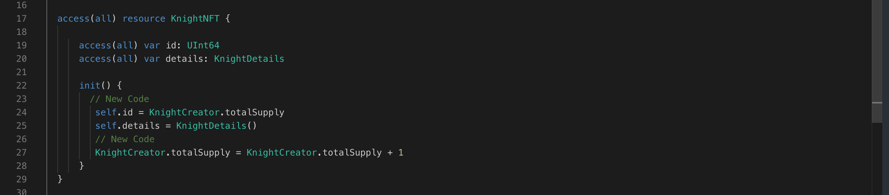

Math in Cadence is pretty straightforward. The following operations are the same as in most programming languages:

Addition: x + y
Subtraction: x - y,
Multiplication: x \* y
Division: x / y
Modulus / remainder: x % y (for example, 13 % 5 is 3, because if you divide 5 into 13, 3 is the remainder)

```jsx
access(all) contract Example {
    access(all) var myInteger: Int

    access(all) fun increment() {
        self.myInteger = self.myInteger + 1
    }

    access(all) fun decrement() {
        self.myInteger = self.myInteger - 1
    }

    init() {
        self.myInteger = 100
    }
}
```

Note that we use the self keyword to indicate a variable that exists 1 layer outside of our function’s scope.

### PUT IT TO THE TEST

1. Open Flow [Playground](https://play.flow.com/)
2. Use create keyword and move operator to form your first Knight.

Next, we’ll create our first Knight.

### Solution !!


