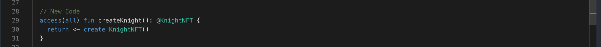

Let's create our first Knight using the createKnight function we defined earlier.

To create a resource, we will use the create keyword and the move operator `<-`. You use the create keyword to initialize a resource. Resources must be created before you can use them.

The move operator `<-` is used to move a resource into a variable. You cannot use the assignment operator = with resources, so when you initialize a resource, you will need to use the move operator `<-`.

```jsx
access(all) contract HelloWorld {

    // Declare a resource that only includes one function.
    access(all) resource HelloAsset {}

    // We're going to use the built-in create function
    // to create a new instance of the HelloAsset resource
    access(all) fun createHelloAsset(): @HelloAsset {
        return <- create HelloAsset()
    }

    init() {
        // contract initializer function
    }
}
```

### Put It to the Test

1. Open Flow [Playground](https://play.flow.com/)
2. Use create keyword and move operator to form your first Knight.

Lastly, we’ll save the created Knight in our contract.

### Solution !!


