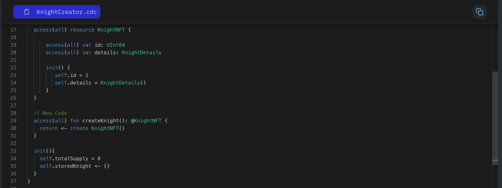

Now, let's store Knights in our contract in the storage we created in lesson 8.

For that we will create a function and call the dictionary and store the `KnightNFT` resource to it. Let’s see the below code, how we are storing `Country` resource.

```jsx
access(all) contract HellWorld {

//.....above code
  access(all) fun storeCountry(country: @Country) {
      self.storedCountries[country.id] <-! country
  }

//...more code
}
```

### **Explanation:**

- Inside the `storeCounty` function, we use this operator: `<-!`. This is called the “force-move operator”. Cadence requires us to use this with dictionaries because it will abort the program if a Knight at the specific `id` already exists.
- This is protecting us from accidentally overwriting a Knight in the dictionary.

### Put It to the Test

1. Open Flow [Playground](https://play.flow.com/)
2. Create a public function named `storeKnight` with one parameter as `knight` resource

### Solution !!


