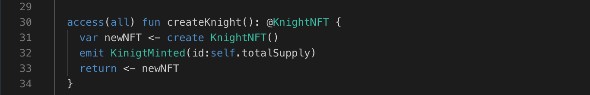

Our contract is almost finished! Now let’s add an event.

Events are a way for your contract to communicate that something happened on the blockchain to your app front-end, which can be ‘listening’ for certain events and take action when they happen.

```cadence
// declare the event
access(all) event IntegersAdded(x: UInt64, y: UInt64, result: UInt64);

access(all) fun add(x: UInt64, y: UInt64): UInt64 {
    let result: UInt64 = x + y
    // fire an event to let the app know the function was called:
    emit IntegersAdded(x: x, y: y, result: result)
    return result
}
```

### **Putting it to the Test:**

1. Open Flow [Playground](https://play.flow.com/)
2. Declare an event called New. It should pass kittyId (a UInt64), name (a String), and dna (a UInt64).

Modify the createRandomKitty function to fire the NewKitty event after adding the new Kitty to our kitties array.

You’re going to need the Kitty’s id. For this scenario, we can use totalKitties as the id, since it will increment upon the creation of every new Kitty.

### Solution !!




