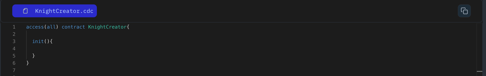

Let's start from the very beginning:

Think of contracts as blueprints for your code. They hold the building blocks—variables and functions—that make your project work.

Let's create a simple contract called **_HelloWorld_**:

```jsx
access(all) contract HelloWorld {

	init(){

	}
}
```

- **_access(all)_** makes the contract public, allowing anyone to read it.
- **_contract_** defines a contract named HelloWorld.
- **_init()_** is the initializer function that runs once when the contract is first deployed.

### Put it to the Test

1. Open Flow [Playground](https://play.flow.com/)
2. To start building our Knight Knight, create a contract named KnightCreator with a public access modifier.

### Solution !!


