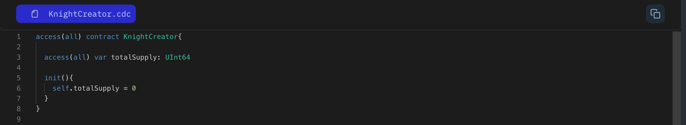

In cadence variables are like bits of information that stored on the blockchain, much like writing data to a database. In Cadence, we use two main keywords:

`var` for variables that can change.
`let` for constants that can not be change.

```jsx
access(all) contract HelloWorld {

	// Declare a variable named greetings
	access(all) var country: String

	// Declare a constant named num
	access(all) let population: UInt64

	init(){
		self.country = "India"
		self.population = 10
	}
}
```

- **var** is used for variables and **let** for constants.
- **country** & **population** are variables and constants, respectively.
- **String** & **UInt64** are types representing text and unsigned integers.
- The **init** function initializes these values when the contract is deployed.

### Put it to the Test

1. Open Flow [Playground](https://play.flow.com/)
2. Create a public variables, `totalSupply` of type `UInt64`, initialized with 0.

Next, we’ll explore how to create unique and valuable entities using resources.

### Solution !!


