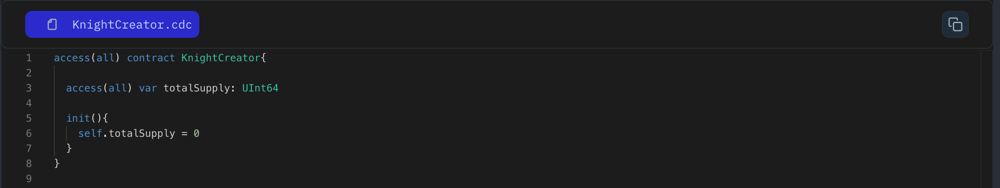

Variables in Cadence act like storage boxes on the blockchain, holding information similar to how a database stores data. In Cadence, we use two main keywords:

1. `var` for variables that are initialized with a value and can be reassigned later.
2. `let` for constants that are initialized with a value and cannot be reassigned afterwards.

Let's look at the example below:

```jsx
access(all) contract HelloWorld {
  // Changeable variable (using 'var')
  access(all) var country: String
  // Constant (using 'let')
  access(all) let population: UInt64

  init() {
    self.country = "India"
    self.population = 10
  }
}
```

### Put it to the Test

1. Open Flow [Playground](https://play.flow.com/)
2. Create a public variables, `totalKnight` of type `UInt64`, initialized with `0`.

Next, we’ll explore how to create unique and valuable entities using resources.

### Solution !!



## Lesson 3: State Variables

State variables store data within a contract on the Flow blockchain. They're like tiny storage boxes that hold information similar to how a database manages data.

**Variable Types:**

Cadence uses two main keywords to define variables:

- **`var`:** Used for variables that can be changed after they're initially set.
- **`let`:** Used for constants that cannot be changed after being assigned a value.

**Example Contract:**

Here's a `HelloWorld` contract with state variables:

```cadence
access(all) contract HelloWorld {

  // Public variable (can change)
  access(all) var country: String

  // Public constant (cannot change)
  access(all) let population: UInt64

  init() {
    self.country = "India"
    self.population = 10
  }
}
```

**Breakdown:**

- **`access(all)`:** Makes the contract and its members publicly accessible.
- **`var country: String`:** Declares a variable named `country` of type `String`.
- **`let population: UInt64`:** Declares a constant named `population` of type `UInt64` (unsigned 64-bit integer).
- **`init()`:** The initialization function that sets the initial values for `country` and `population`.

**Putting It to the Test:**

Open the Flow Playground and create a new contract with a public variable named `totalSupply` of type `UInt64` initialized to 0.

**Next Lesson:**

We'll explore how to create unique and valuable entities using resources in Flow.
