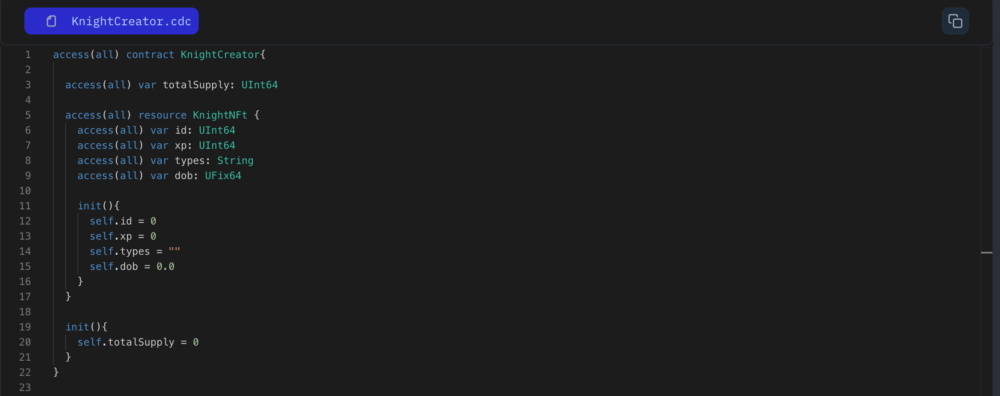

Flow allows you to create special items called resources. These are unique and valuable, like the Mona Lisa painting or a unique Viking sword. They ensure secure ownership and control on the blockchain.

To create a resource we use the **_resource_** keyword to create them:

```jsx
access(all) contract HelloWorld {

	access(all) resource World {

	  init() {
		// Initialization code
	  }
	}
}

```

Inside a resource, you can define variables and functions. Every time you create a resource, you must include an initializer to set initial variable values. Here's an example:

```jsx

// Declare a resource named `World`
access(all) resource World{
	access(all) var name: String
	access(all) var capital: String

	init(_name: String, _cap: String){
		self.name = _name
		self.capital = _cap
	}
}
```

### Put it to the Test

1. Open Flow [Playground](https://play.flow.com/)
2. Create a resource named KnightNFT.
3. Inside the resource, create three public variables named **_id_** (of type UInt64), **_name_** (of type String), and **_power_** (of type UInt64). Initialize id with a value of 0.

Next, we’ll learn how to organize related data using structs.

### Solution !!


