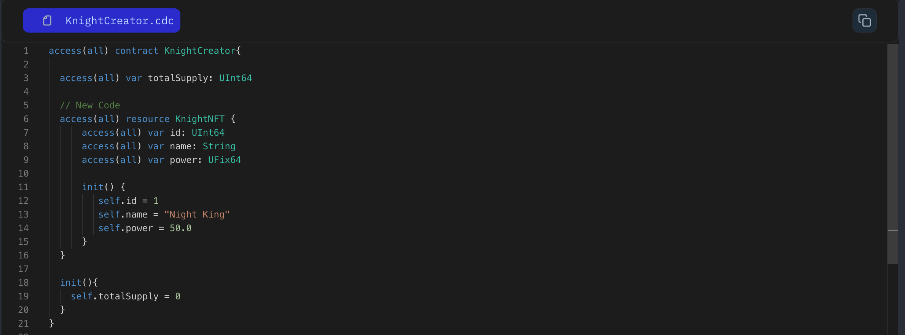

Imagine a resource like a one-of-a-kind treasure in your Knight Game. It could be a legendary sword, a mystical shield, or even a powerful spell. Resources are special because they have unique properties:

1. `Single Location`: A resource can only exist in one place at a time.
2. `One-Time Use`: Once a resource is used, it's considered consumed and cannot be used again.
3. `Creation`: Resources are created using the `create` keyword.
4. `Movement or Destruction`: A function using resources must be either moved or destroyed at the end of the function.

Let's create a `Country` resource: To create a resource we use the `resource` keyword to create them:

```jsx
access(all) contract HelloWorld {

    // Define a resource named 'World'
	access(all) resource Country {
      // Initializer function to set up the resource
	    init() {}
	}
}

```

Inside a resource, you can define variables and functions. Every time you create a resource, you must include an initializer to set initial variable values. Here's an example:

```jsx
  access(all) resource Country {

    // Variables and functions can be defined within a resource
    access(all) var name: String
    access(all) var capital: String

    // Every resource needs an initializer to set initial values
    init(_name: String, _cap: String) {
      self.name = _name
      self.capital = _cap
    }
}
```

### Put it to the Test

1. Open Flow [Playground](https://play.flow.com/)
2. Create a resource named `Knight`.
3. Define variables inside the resource: Create three variables

- `id` (of type UInt64)
- `name`(of type String)
- `power`(of type UInt64).
- Initialize `id` with a value of 0.

### Solution !!


