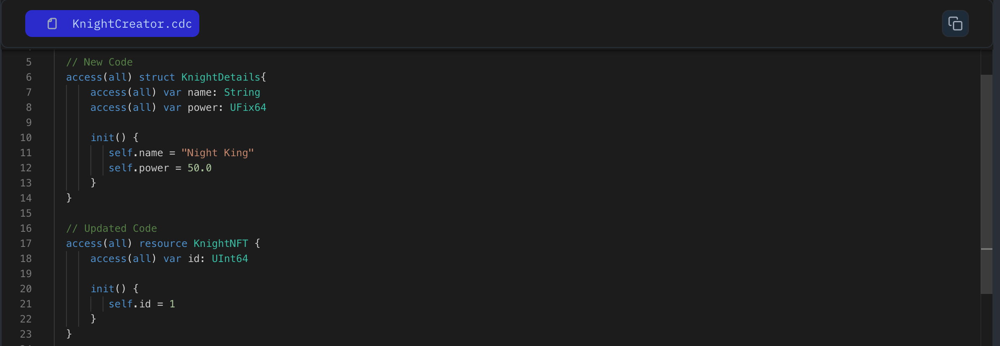

A **_struct_** (short for structure) is like a container that holds different types of information under one label. Structs help organize related pieces of data together.

For instance, to track details about a country, you can use a struct to group attributes like Name, Population, Ratings, and Country ID:

```jsx

// Define a struct named `Country`
access(all) struct Country {

}

```

Inside a struct, you can define variables and functions. Every time you create a struct followed by the structure name, you must include an initializer to set initial variable values. Let's take a look:

```jsx

// Define a struct named `Book`
access(all) struct Country {
    access(all) var country_ID: UInt64
    access(all) var name: String
    access(all) var population: UFix64
    access(all) var has_Coastline: Bool

    init(_name: String, _population: UFix64){
        self.country_ID = 1
        self.name = _name
        self.population = _population
        self.has_Coastline = True
    }
}

```

### Put it to the Test

1. Open Flow [Playground](https://play.flow.com/)
2. Create a struct named `KnightDetails`.
3. Inside add two variable `name` (of type String) and `power` (of type UInt64)
4. Initialize name and power in the init function.
5. And delete these variable from the `KnightNFT` resource

Next, we’ll combine resources and structs to store structured information.

### Solution !!


