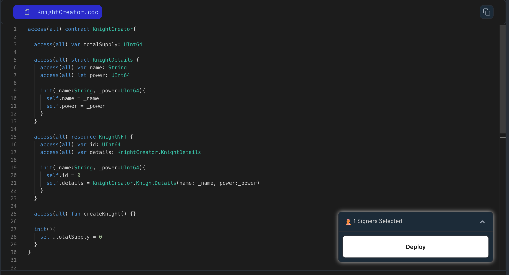

Remember the `World` resource and `Country` struct from Lesson 4 and 5? let's use in this lesson.

### World Resource with Country Details

We will use our previously created `World` resource for a single country. This resource will leverage the Country struct to store the country's specific information in a structured format.

Here's how the `World` resource might look:

```cadence
access(all) resource World {

    access(all) var country: Country

    init(_name: String, _population: UFix64){
        self.book = Country(_name: _name, _population: _population)
    }
}
```

### Put it to the Test

1. Open Flow [Playground](https://play.flow.com/)
2. Use `KnightDetails` inside a `KnightNFT` resource. This way, we keep knight data organized and easy to manage.

Next, we’ll learn about dictionaries, which are essential for efficient data management.

### Solution !!


