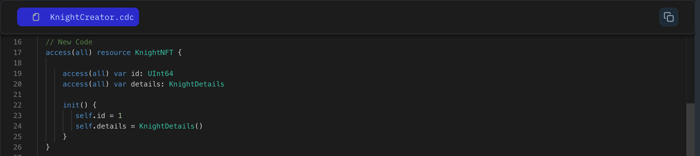

Recall the `World` resource from Lesson 4 and the `Country` struct from Lesson 5.
In this lesson, we'll look how to effectively combine them to structure data within resources.

Imagine using the `World` resource to represent a single country, but with detailed information stored in a structured manner. Here's how we can achieve this by leveraging the `Country` struct:

```jsx
access(all) resource World {

  access(all) var id: UInt64
  // Access modifier can be adjusted based on needs (e.g., public, private)
  access(all) var country: Country

  init(_name: String, _population: UFix64) {
    self.id = 0
    self.country = Country(_name: _name, _population: _population)
  }
}
```

### Put it to the Test

1. Open Flow [Playground](https://play.flow.com/)
2. Add the `KnightDetails` struct within the `Knight` resource.

### Solution !!


