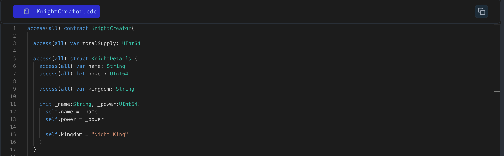

Dictionary is a data structure that stores key-value pairs. Each key in the dictionary maps to a specific value, allowing efficient retrieval and manipulation of data.

Let's see how to create and use dictionaries in Cadence:

```jsx
// Declare a dictionary to store countries by their ID
let countryDictionary: { UInt64: String };

// Initialize the dictionary with some values in init function
init(){
  self.countryDictionary = {1: "USA",2: "Canada", 3: "UK"}
};
```

- `{UInt64: String}`: Defines a dictionary where keys are of type `UInt64` and values are of type `String`.
- `countryDictionary`: Represents the name of the dictionary variable.
- `{}`: Initializes an empty dictionary.

Dictionaries in Cadence are versatile and useful for organizing data in various scenarios.

### Put It to the Test

1. Open Flow [Playground](https://play.flow.com/)
2. Create an empty dictionary named `storeKnight`.

Next, we’ll see how to store data using these dictionaries.

### Solution !!


