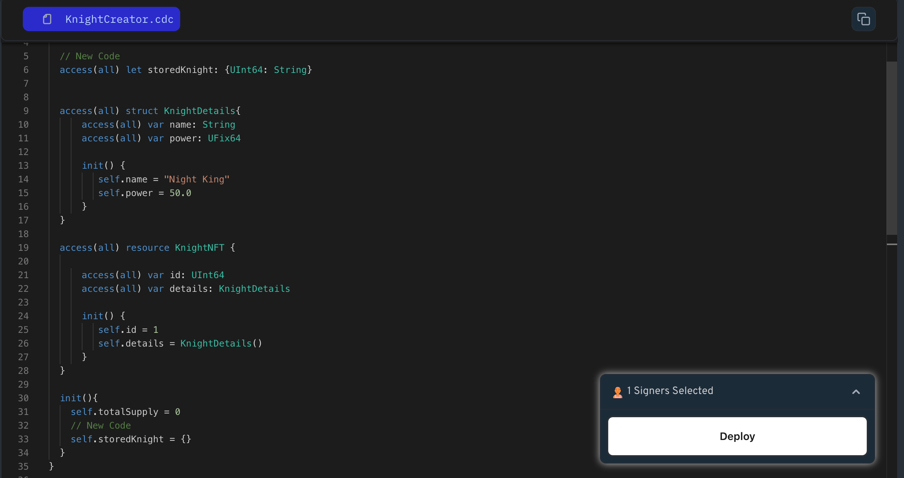

Dictionary is a data structure that stores key-value pairs. Each key in the dictionary maps to a specific value, allowing efficient retrieval and manipulation of data.

Let's see Creating and Using Dictionaries in Cadence:

```jsx
// Declare a dictionary to store countries by their ID
let countryDictionary: { UInt64: String }

// Initialize the dictionary with some values in init function
init(){
  self.countryDictionary = {1: "USA",2: "Canada", 3: "UK"}
}

// Accessing a value by its key
let name1 = countryDictionary[1] // "USA"

// Modifying a value
countryDictionary[1] = "United States"

// Accessing a value by its key
let name2 = countryDictionary[1] // "Unites States"
```

Dictionaries in Cadence are versatile and useful for organizing data in various scenarios.

### Put It to the Test

1. Open Flow [Playground](https://play.flow.com/)
2. Create an empty dictionary named `storeKnight`.

### Solution !!


