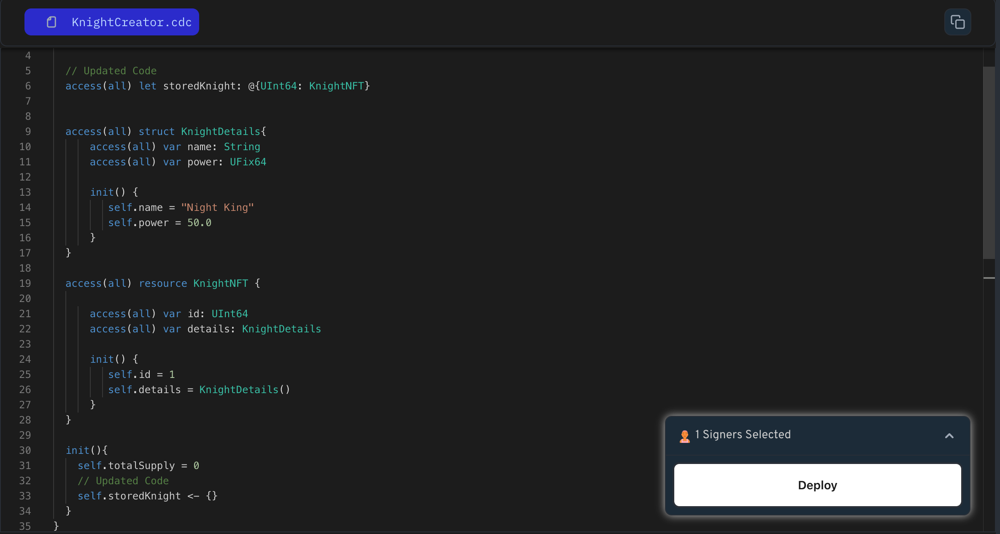

Now that you know about `resources` and `dictionaries`, let's use them together to store your knights in the game contract. This way, all the knights in the game can be tracked in one place.

**Storing Knights with a Dictionary**: Imagine a special book in your game where you keep track of all the knights. This book is like a dictionary, where each knight has a unique ID (like a page number) and their details are stored on that page.

Here's how we can create this dictionary in Cadence:

```jsx
access(all) contract HelloWorld {

    // Declare a dictionary to store countries by their ID
    access(all) let storedCountries: @{UInt64: Country}

    // Declare a resource Country
    access(all) resource Country{}

    // Initialize the dictionary in the contract's initializer
    init() {
        self.storedCountries <- {}
    }
}
```

The storedCountries dictionary isn't a resource itself, but it stores resources (countries). Therefore, we treat it like a resource by using `<-` to initialize it in the contract's initializer.

Remember, when defining a resource type, the `@` symbol must be added.

### Put It to the Test

1. Open Flow [Playground](https://play.flow.com/)
2. Create a public dictionary named `storedKnight` of type resource and initialize its value in the contract `init` function.

### Solution !!


