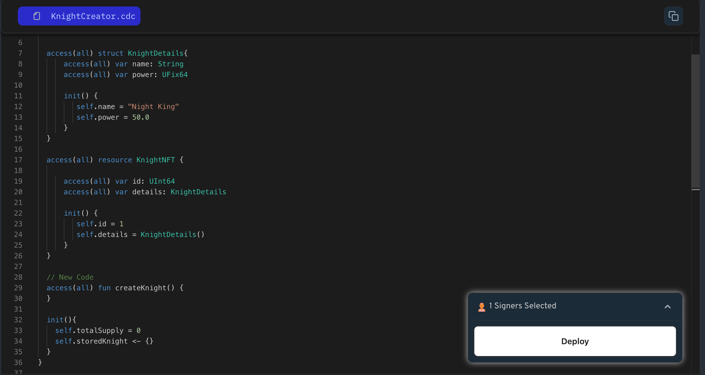

Declaring a function involves specifying its visibility, function name, parameters, and return type (if any).

```jsx
// Define a function named setNewValue
access(all) fun setNewValue() {
    // Function body
}
```

### Put it to the Test

1. Open Flow [Playground](https://play.flow.com/)
2. Create a public function named `createKnight`.

Next, we’ll explore basic math operations in Cadence.

### Solution !!


