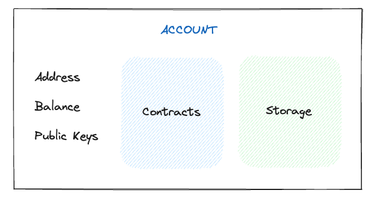

Welcome back, adventurer! In this lesson, we'll explore how to store your Knight NFT securely within your Flow account. Sound exciting right? Let's see how we can do it.

### Understanding Account & Storage:

Imagine your Flow account as a two-story building:

- Upstairs (Contract): This is where all the programs (contracts) live.
- Downstairs (Storage): This is your personal space, accessed through a special path: /storage/. Here, you can keep all your valuables, like your Knight NFT.

:::note
Paths like /storage/ act like special instructions that tell the system exactly where to find information. Just like your home address helps mail carriers deliver letters, the path helps locate your specific storage area within your Flow account.
:::

### Levels of Access: Organizing Your Storage!

Your Storage has 3 different paths:

- `/storage/`: Private area. Only you have access.
- `/public/`: Publicly visible, but not accessible by others.
- `/private/`: Accessible only by you and those you permit.

Ah! We've learned a lot. As we explore further, you'll learn how to move your Knight from a shared space to your very own vault. Exciting, right?

Now, let's move forward and see how to organize your Knight NFT ✨.
