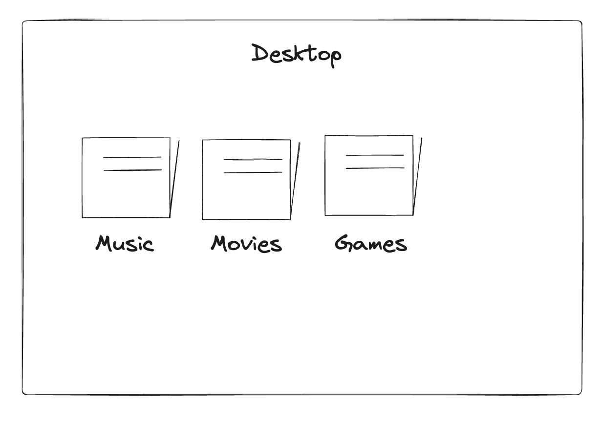
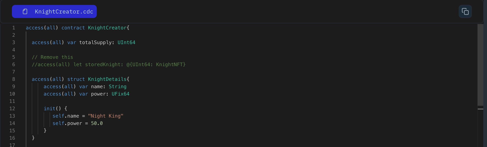
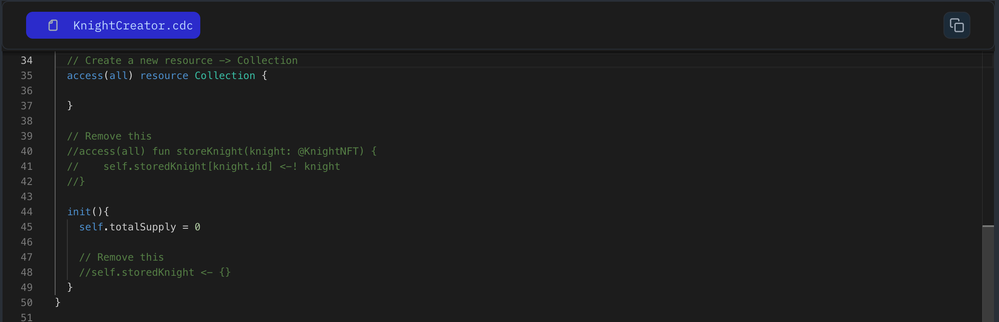

In this lesson, we will guide you in organizing your Knight NFT into personalized space! rather than storing in the contract space.

For that, we are introducing you to the new concept called **`Collections`**. Collection is an object that can hold multiple NFTs of the **same type**.

Imagine a messy desktop holding photos, music files, movies scattered across. You access desktop and create separate folders for photos, music, movies for better organization.



Now let's understand how we can create a collection.

```jsx
// contract code
access(all) contract HelloWorld: NonFungibleToken {

  // This is like a special room inside your contract,
  // but only for NFTs!
  access(all) resource Collection {
  }
}
```

### **Put it to the Test:**

1. Open Flow [Playground](https://play.flow.com/)
2. Create a resource name Collection.
3. Remove the storedKnight dictionary and storeKnight function for now.

### Solution !!



