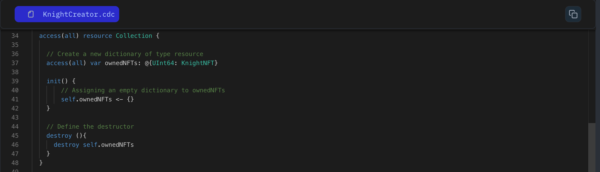

Although those collections you created might be empty now, that's fine. Let's learn how to add NFTs to it using nested resources.

Creating Nested Resources
A nested resource means one resource owns another. Here's how to set up a collection that holds multiple NFTs. Let's take a look at the below code snippet.

```jsx
// Our Collection with a built-in backpack!
access(all) resource Collection {

    // This is like the backpack that holds all the cool stuff (NFTs)
    access(all) var ownedNFTs: @{UInt64: NFT}

    // This function creates an empty backpack when a new Collection is made
    init() {
        // Assigning an empty dictionary to ownedNFTs
        self.ownedNFTs <- {}
    }

    destroy(){
        destroy self.ownedNFTs
    }
}
```

### **Put it to the Test:**

1. Open Flow [Playground](https://play.flow.com/)
2. Remember how we created a resource dictionary in Module 2 L8? Similarly, create `ownedKnight` and store it in a previously created resource collection.

### Solution !!


