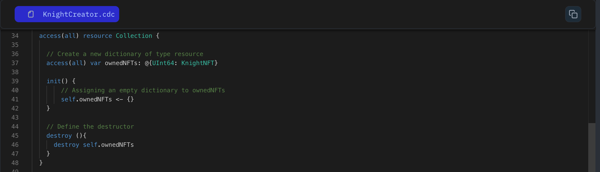

In last lesson you have seen the nested resource, but have you notice we haven't discuss about destroy function we have define. Right?

In Cadence, when every we their is nested resource you have a destructor function, which is executed when the resource is destroyed. Destructors have no parameters and no return value and are declared using the `destroy` keyword. A resource can have only one destructor.

```jsx
// Define a resource named `Collection`
access(all) resource Collection {

    // Define the destructor
    destroy() {}
}
```

### Put it to the Test

1. Open Flow [Playground](https://play.flow.com/)
2. Create a `destroy` function in the `Collection` resource.

### Solution !!


