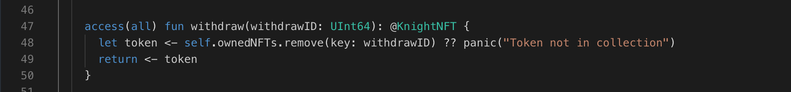

Great job! Now you have your Knight NFT stored in your collection. But what if you want to take a special NFT out for a spin? Maybe you want to trade it for something else, or even sell it on a marketplace! That's where the withdraw function comes in!

### Creating the Withdraw Function

The withdraw function allows you to take an NFT out of your collection. It's secure, ensuring only the owner can perform withdrawals.

Let's take a look at the code and understand how to create withdraw function

```jsx
// resource declaration
access(all) resource Collection {

  // function declaration
  access(all) fun withdraw(withdrawID: UInt64): @NFT {
    // Let's find the NFT you want to take (based on its ID)
    // Then it searches the collection dictionary and pass it to token
    let token <- self.ownedNFTs.remove(key: withdrawID)

    // Uh oh, the NFT wasn't found! Let the user know "Oops, that NFT isn't in your collection!"
    ?? panic("Token not in collection")

    // If all goes well, return the NFT you grabbed!
    return <- token
  }
}
```

### **Put it to the Test:**

1. Open Flow [Playground](https://play.flow.com/)
2. Add the withdraw function to the Collection resource.

### Solution !!


