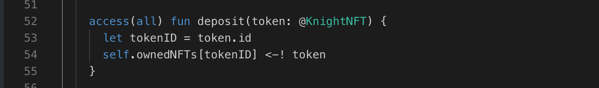

Just like you can withdraw an NFT, you can also add new ones with the deposit function, which acts as a special entrance to your collection.

Let's take a look at the code and understand how to create deposit function

```jsx
// Our trusty vault (collection) with a special entrance (deposit function)
access(all) resource Collection {

  // This function is like the entrance for new treasures (NFTs)
  access(all) fun deposit(token: @NFT) {

    // Let's get the ID of the NFT you want to deposit
    let tokenID = token.id

    // Add the new NFT to your collection's dictionary.
    self.ownedNFTs[tokenID] <-! token
  }
}
```

### **Put it to the Test:**

1. Open Flow [Playground](https://play.flow.com/)
2. Add the deposit function to the Collection resource.

### Solution !!


