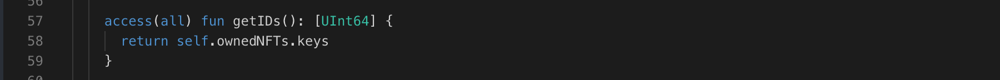

Keeping track of your NFTs can get tricky. That’s where the `getIDs` function comes in, allowing you to count all the unique NFTs in your collection.

Let's take a look at the code and understand how to create getId function.

```jsx
// Our trusty treasure chest (collection) with a special counting tool (getId function)
access(all) resource Collection {

  // This function acts like a magic counter for your treasures (NFTs)!
  access(all) fun getIDs(): [UInt64] {
    // Look inside your collection's storage (dictionary) and count the keys (NFT IDs)
    return self.ownedNFTs.keys
  }
}
```

### **Put it to the Test:**

1. Open Flow [Playground](https://play.flow.com/)
2. Add the getIDs function to the Collection resource.

### Solution !!


