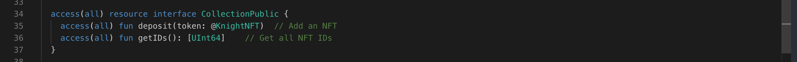

Congrats for making this far. Wooh!!

You remember all those awesome functions you learned to manage your NFT collection? Now we're about to take things a step further with interfaces.

Imagine you're playing a game with your friends, and each of you has a box with some toys inside. Now, to make sure everyone plays the game fairly and knows what they can do with their box toys, you set up some rules.

These rules are like interfaces in programming. They define what each toys must have and what it can do. In our example, we created the "Collection" interface, which says that every toy must:

- Allow players to put toy in box (deposit).
- and allow players to count how many toys they have. (getIDs)

```jsx
// Interface definition (blueprint)
access(all) resource interface ToyInterface {
  access(all) fun deposit(token: @NFT)  // Add an NFT
  access(all) fun getIDs(): [UInt64]    // Get all NFT IDs
}

// Specific resource (box for toys) using the interface
access(all) resource ToyNFTCollection: ToyInterface {
  // ...[ToyInterface code implementing deposit and getIDs functions]...
}

```

### **Put it to the Test:**

1. Open Flow [Playground](https://play.flow.com/)
2. Create the resource interface for the Collection named as `CollectionPublic`.

### Solution !!


