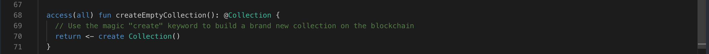

Remember all those cool NFTs you've been collecting? What if you find a new one you love, but don't have a place to store it yet? No worries, adventurer! Today's lesson is about creating collections instantly, whenever you need them.

It's pretty straightforward function – it lets you create a brand new collection with just one simple function call. Just clicking a button and boom – your vault is ready to rock!

### Let's Peek at the Code!

```jsx
// This function acts like a magic button to create a new empty treasure chest (collection)
access(all) fun createEmptyCollection(): @ToyNFTCollection {
  // Use the magic "create" keyword to build a brand new collection on the blockchain
  return <- create ToyNFTCollection()
}
```

### **Put it to the Test:**

1. Open Flow [Playground](https://play.flow.com/)
2. Create a function named `createEmptyCollection`
3. Create a Collection resource and return it.

### Solution !!


