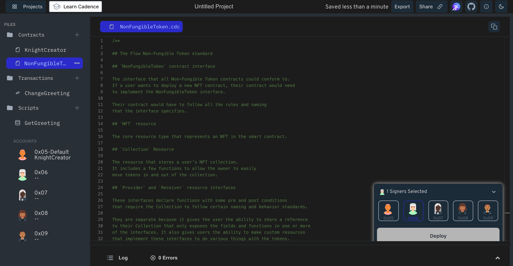

Let's talk about tokens.

If you've been in the Blockchain space for any amount of time, you've probably heard people talking about tokens — specifically ERC20 tokens.

A token is basically just a smart contract that follows some common rules — namely it implements a standard set of functions that all other token contracts share. It keeps track of who owns how much of that token, and some functions so those users can transfer their tokens to other addresses.

Click here [link](https://developers.flow.com/build/core-contracts) to take a look at the all the flow core smart contracts standards.

In our game we will be using [Flow NFT standard](https://developers.flow.com/build/core-contracts/non-fungible-token)

Think a standard like a Legos! Just like Legos snap together seamlessly, the Flow NFT Standard ensures all NFTs are built the same way. NFTs built with the same standard can be easily bought, sold, and transferred between different dapps or marketplaces in the Flow world.

### **Put it to the Test:**

1. Open Flow [Playground](https://play.flow.com/)
2. Create a new contract named - NonFungibleToken
3. Paste the NFT from [here](https://testnet.flowdiver.io/contract/A.631e88ae7f1d7c20.NonFungibleToken?tab=deployments) into the newly created contract.

### Solution !!

