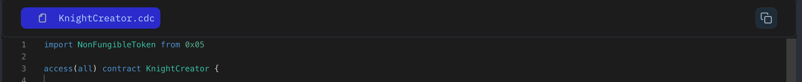

When you want to use external code in your project, Cadence provides the import keyword to bring pre-written code into your code, making your work faster!

Let take a look at the below code and see we do.

```jsx
// Import the type `Counter` from a local file.
import Counter from "./examples/counter.cdc"

// Import the type `Counter` from an external account.
import NBATopShot from 0x299F20A29311B9248F12
```

### **Put it to the Test:**

1. Open Flow [Playground](https://play.flow.com/)
2. Let's go back to our Knight contract and try to import a `NonFungibleToken` which we have added in previous lesson.

### Solution !!


