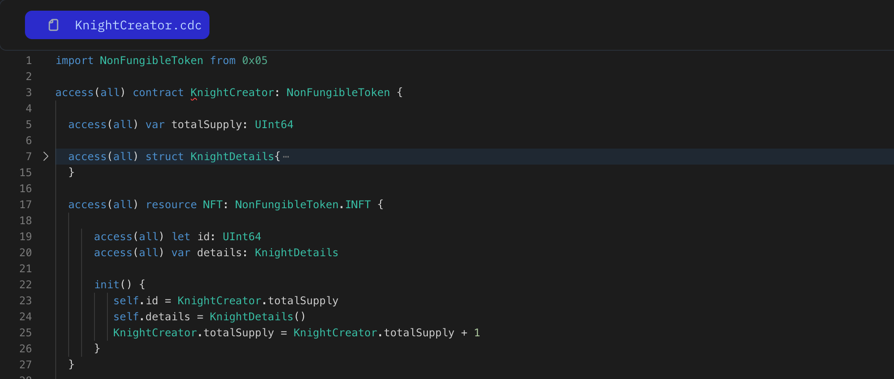

Update contract and NFT Resource, Add the `NonFungibleToken` to represent this contract follow non-fungible token standard and change the KnightNFT resource to NFT resource and use NonFungibleToken NFT interface `NonFungibleToken.INFT`. Make sure change the id variable to `let` as it provided by the standard.

```jsx
import NonFungibleToken from `0xaddress`

access(all) contract HelloWorld: NonFungibleToken {

    access(all) resource NFT: NonFungibleToken.INFT {
        access(all) let id: UInt64

        init() {
            self.id = 1
        }
    }
}
```

### **Put it to the Test:**

1. Open Flow [Playground](https://play.flow.com/)
2. import NonFungibleToken standard into our contract
3. Mark the contract and NFT as of NonFungibleStandard.

### Solution !!


