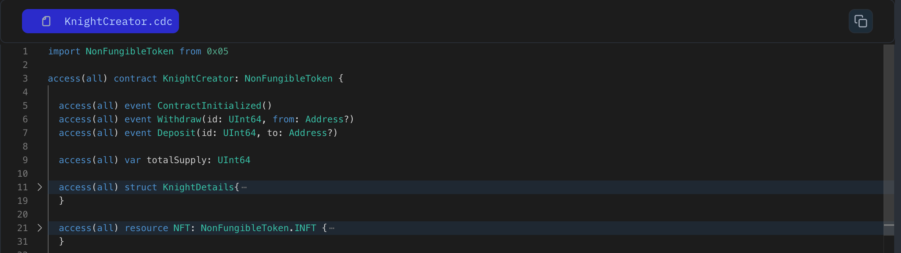

Are you getting some error? Don't worry we will resolve them now.

Imagine a world where your Flow NFT collection is like a bustling library! Users can now "borrow" your awesome NFTs with the brand new borrowNFT function. This lets them get a closer look or interact with your NFTs temporarily, just like checking out a book. Here's how it works:

### **Implementation:**

```jsx
import NonFungibleToken from 0x1d7e57aa55817448

access(all) contract FooBar: NonFungibleToken {
    access(all) var totalSupply: UInt64
    access(all) event ContractInitialized()
    access(all) event Withdraw(id: UInt64, from: Address?)
    access(all) event Deposit(id: UInt64, to: Address?)

    init() {
        self.totalSupply = 0
        emit ContractInitialized()
    }
}
```

### **Explanation:**

The `borrowNFT` function takes an `id` parameter representing the unique identifier of the NFT to be borrowed. Inside the function, we use the `ownedNFTs` dictionary to look up the NFT associated with the provided ID. We return a reference to the NFT, allowing users to borrow it temporarily. If the NFT with the provided ID doesn't exist in the collection, the function returns `nil`.

### **Put it to the Test:**

### Solution !!


