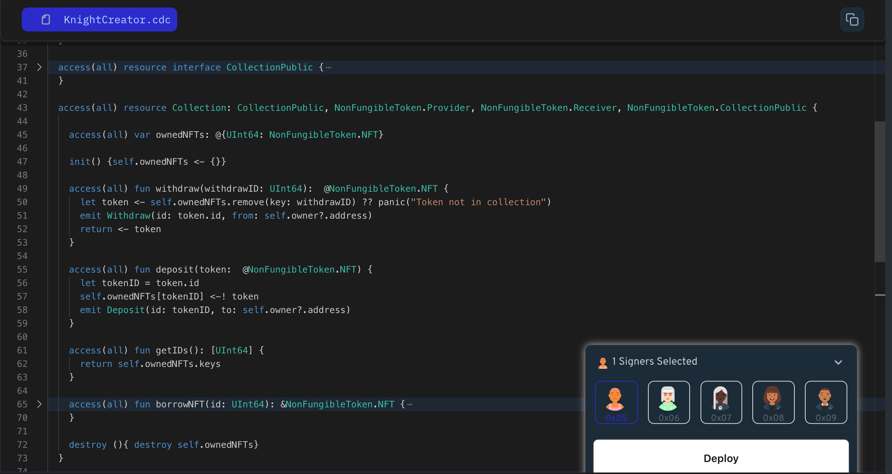

Building your own NFT collection? That's fantastic! But what if you could make it even more interesting for people to use? In this lesson we will learn how to add features that let people interact with your NFTs in new ways.

To handle NFT even more better way. Let's add the potential of `NonFungibleToken.Provider`, `NonFungibleToken.Receiver`, and `NonFungibleToken.CollectionPublic` interfaces. These are like pre-programmed superpowers for your collection, giving it the ability to:

- **Lend out NFTs:** allow users to view an NFT's without taking out of the collection.
- **Accept new NFTs:** using `NonFungibleToken.Receiver`, your collection can gracefully accept new NFTs from other accounts.
- **Speak the standard language:** The `NonFungibleToken.CollectionPublic` interface makes your collection a part of the Flow NFT community, ensuring smooth interaction with other NFT-savvy applications.

Let's take a look how we can implement this -

```jsx
pub resource Collection: NonFungibleToken.Provider, NonFungibleToken.Receiver, NonFungibleToken.CollectionPublic {

    // update the ownedNFTs, deposit, and withdraw functions to use the NonFungibleToken.NFT type
    pub var ownedNFTs: @{UInt64: NonFungibleToken.NFT}

    // Add new borrowNFT function
    // Access a read-only reference to an NFT in the collection without actually removing it
    pub fun borrowNFT(id: UInt64): &NonFungibleToken.NFT {
        // Code to lend out an NFT for viewing
    }

    pub fun deposit(token: @NonFungibleToken.NFT) {
        let tokenID = token.id
        self.ownedNFTs[token.id] <-! token
        emit Deposit(id: tokenID, to: self.owner?.address)
    }

    pub fun withdraw(withdrawID: UInt64): @NonFungibleToken.NFT {
        let token <- self.ownedNFTs.remove(key: withdrawID) ?? panic("Token not in collection")
        emit Withdraw(id: token.id, from: self.owner?.address)
        return <- token
    }

}
```

### **Put it to the Test:**

1. Open Flow [Playground](https://play.flow.com/)
2. Update the collection resource with interface.
3. Add borrowNFT function in the collection resource.

### Solution !!


