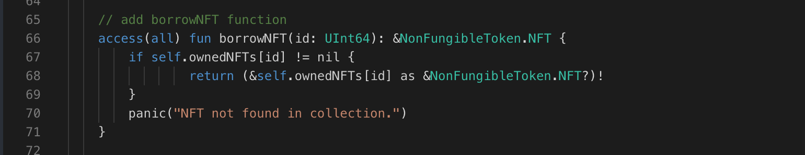

Imagine a world where your Flow NFT collection is like a bustling library! Users can now "borrow" your awesome NFTs with the brand new borrowNFT function. This lets them get a closer look or interact with your NFTs temporarily, just like checking out a book. Here's how it works:

### **Implementation:**

```jsx
access(all) view fun borrowNFT(_ id: UInt64): &NonFungibleToken.NFT {
    return (&self.ownedNFTs[id] as &NonFungibleToken.NFT?)!
}
```

### **Explanation:**

The `borrowNFT` function takes an `id` parameter representing the unique identifier of the NFT to be borrowed. Inside the function, we use the `ownedNFTs` dictionary to look up the NFT associated with the provided ID. We return a reference to the NFT, allowing users to borrow it temporarily. If the NFT with the provided ID doesn't exist in the collection, the function returns `nil`.

### **Put it to the Test:**

### Solution !!


