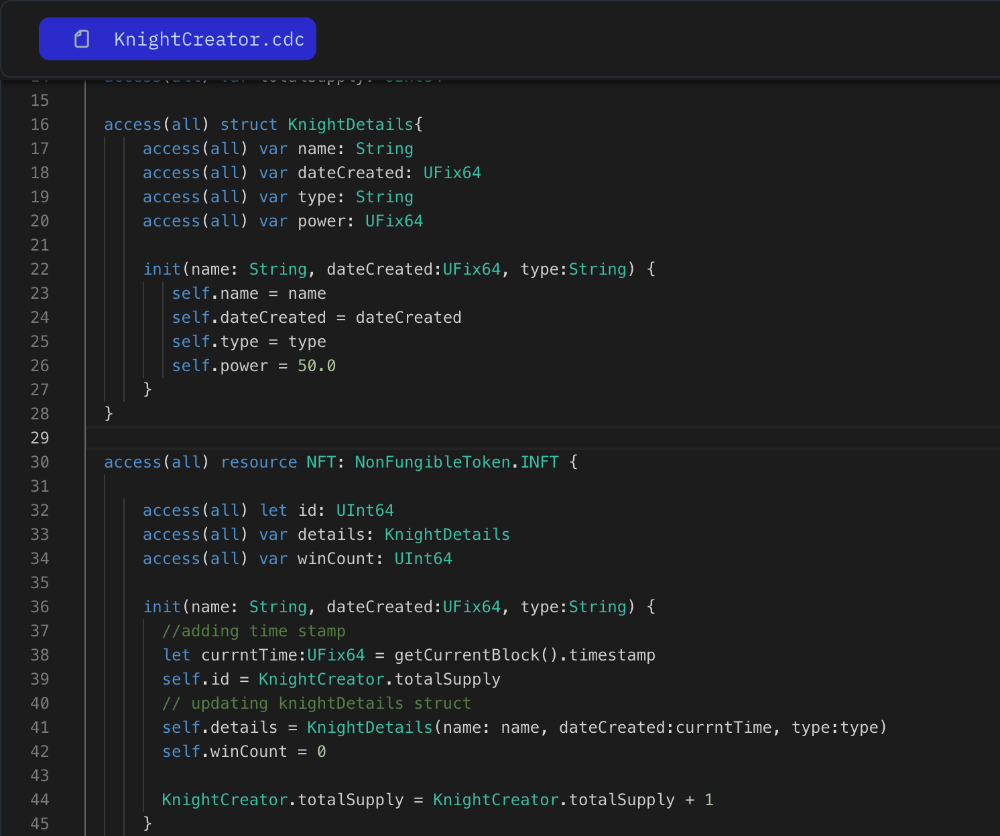
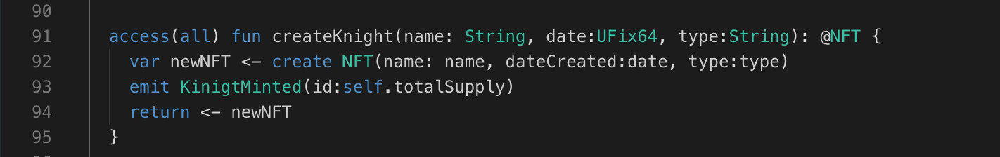

In this lesson, we'll refactor our NFT. We'll define unique identifiers and add more variables. Previously, our NFT had static data; now, we'll make it dynamic.

Every resource in Cadence has a built-in unique identifier that is unique to that resource and will never be repeated, even if the resource is destroyed. This makes for a perfect ID system. Let’s give our Knight an ID using the built-in unique identifiers.

```jsx
access(all) contract HellWorld {
	access(all) resource Country{

		access(all) var id: UInt64

		init(){
			// defining unique identifiers
			self.id = self.uuid
		}
	}
}
```

Let's make our resource dynamic by initializing its values in the init function.

```jsx
access(all) contract HellWorld {

	access(all) resource Country{
		access(all) var id: UInt64
		// adding a new variable
		access(all) var name: String

		// initializing new variable value
		init(_name: String){
			self.id = self.uuid
			self.name = _name
		}
	}
}
```

### Put It to the Test

1. Open Flow [Playground](https://play.flow.com/)
2. Change the knight resource ID to use the built-in unique identifier.
3. Add more variables to the KnightDetails struct, such as:

- dateCreated of type UFix64, indicating when the NFT was created.
- type variable of type String, defining how effective moves can be in battle (e.g., fire, water, rock, grass, electric, ice, flying, ghost, dark, steel, dragon, poison, fighting). We will discuss this variable in upcoming lessons.
- winCount of type UInt64 to the NFT resource to track the knight's win count. Initialize it with a zero value. We will also discuss this variable in upcoming lessons.

:::note
To get the date, you can use block.timestamp, which is a global variable representing the current timestamp of the block being mined. The timestamp is measured in seconds. Use `getCurrentBlock()` timestamp to obtain it.
:::

### Solution !!



---


