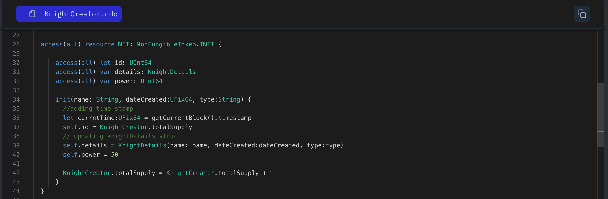

In this lesson we will refactor our NFT, we will define Unique Identifiers, add more variables. Previously our NFT has static data, now we will make it dynamic.

Every resource in Cadence also has a built-in unique identifier that is unique to that resource only, and **will never be repeated again.** Even if the resource is destroyed. This makes for a perfect `id` system. Let’s give our `Knight` an `id` using the built in unique identifiers.

```jsx
access(all) contract HellWorld {
	access(all) resource Country{

		access(all) var id: UInt64

		init(){
			// defining unique identifiers
			self.id = self.uuid
		}
	}
}
```

```jsx
access(all) contract HellWorld {

	access(all) resource Country{
		access(all) var id: UInt64
		// adding a new variable
		access(all) var name: String

		// initializing new variable value
		init(_name: String){
			self.id = self.uuid
			self.name = _name
		}
	}
}
```

Imagine a game where knights have an advantage when fighting in environments that match their training. We can represent this by adding a new property to the KnightDetails struct that specifies the knight's environment (e.g., grass, fire, water, rock).

### Put It to the Test

1. Open Flow [Playground](https://play.flow.com/)
2. Change `knight` resource id with resource built-in unique identifier
   Let's add some more variable such as-

- `dateCreated` of type `UFix64` which tells when the NFT is created.
- `type` of type `String` which define the environment of the knight.
- `winCount` of type `UInt64` which keeps the track of win count of the knight.

### Solution !!


