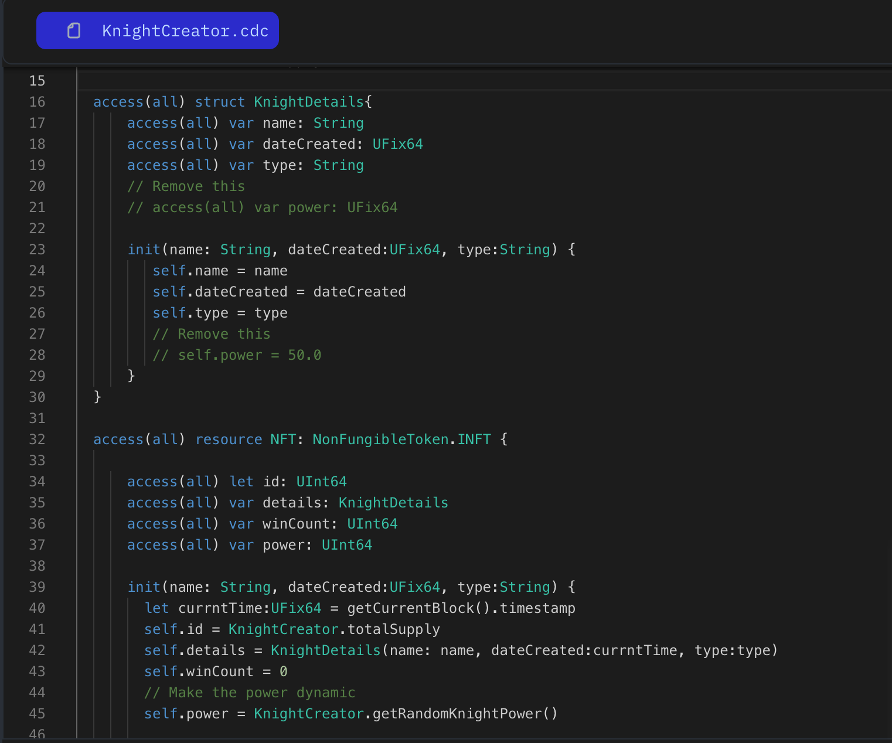
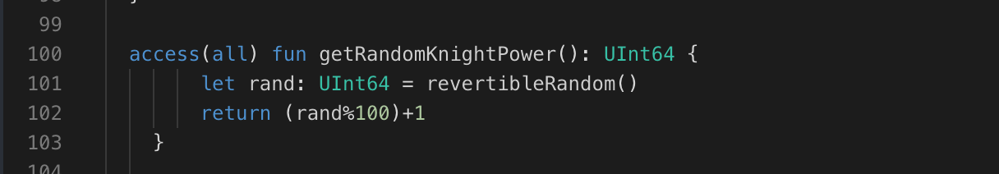

The strength of your Flow Knights is ever-evolving, but how do you determine how much their power grows? This lesson introduces Verifiable Random Functions (VRF) to ensure power increases are awarded fairly and securely.

### **Why Use VRF for Power Boosts? It's All About Fairness and Security!**

VRF takes the guesswork out of randomness, making it perfect for games where a touch of uncertainty adds to the excitement:

- **Unbeatable Fairness:** VRF ensures no one can predict or tamper with the random number generation. This keeps your game honest and rewards truly deserving Knights on their quests for power!
- **Ironclad Security:** VRF utilizes cryptography to guarantee the randomness is secure and unbiased. No sneaky manipulation here!

Let's look at the code and understand how we generate random numbers using VRF:

```jsx
access(all) contract Dice {

    access(all) fun roll(): UInt64 {
        // to generate a random value, call inbuilt revertibleRandom function
        // which utilizes VRF to generate a random, unpredictable number.
        // Think of it as rolling a super secure die!
        let rand: UInt64 = revertibleRandom()
        // And adjust the value based on your desired range by using modulus % and the
        // number in between you want to range, here we are ranging from 0 to 99
        // we add + 1 to it to make the range from 1 to 100.
        return (rand%100)+1
    }

    init() {
    }
}
```

### **Putting it to the Test:**

1. Open Flow [Playground](https://play.flow.com/)
2. Create a `getRandomKnightPower` function and use the `revertibleRandom` built-in function to calculate the knight's power, returning the random value. Ensure you map it between 1 and 100.
3. Move the power variable to the NFT resource and update it by calling the `getRandomKnightPower` function.

### Solution !!



---


