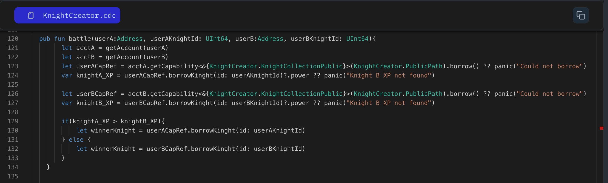

Are you ready for epic clashes!!
In this lesson we will head over to the battle function. The function that determines the winner based on the knights' power and triggers a victory action for the winning knight.

Let's breakdown how we can make this epic clashes between your knights possible

- **The Function:**

  Create a function named `battle` as the fight coordinator. Which takes the address of the players participating in the battle(`userA` & `userB`) and their respective knights id (`userAKnightId` & `userBKnightId`).

  ```jsx
  pub fun battle(userA: Address, userAKnightId: UInt64, userB: Address, userBKnightId: UInt64) {

  }
  ```

- **Accessing storage:**

  We gets the players account by using the `getAccount(address)` function by passing player account address to it and over calling `getCapability` to get the public storage access to borrow the specific knight.

  ```jsx
  pub fun battle(userA: Address, userAKnightId: UInt64, userB: Address, userBKnightId: UInt64) {
    let acctA = getAccount(userA)
    let acctB = getAccount(userB)

    let userACapRef = acctA.getCapability<&{Knight.KnightCollectionPublic}>(Knight.PublicPath).borrow() ?? panic("Could not borrow")
    let userBCapRef = acctB.getCapability<&{Knight.KnightCollectionPublic}>(Knight.PublicPath).borrow() ?? panic("Could not borrow")
  }
  ```

- **XP Check:**

  Once it has the capabilities reference, the function borrows references to the actual knights involved (borrowKnight) using their IDs.
  It then retrieves the crucial stat – experience points (XP) – for each knight (knightA_XP and knightB_XP).

  ```jsx
  pub fun battle(userA: Address, userAKnightId: UInt64, userB: Address, userBKnightId: UInt64) {
    // before code ....

    // borrows knight references of the knight using their IDs.

    let knightA_XP = userACapRef.borrowKnight(id: userAKnightId)?.xp ?? panic("Knight A XP not found")
    let knightB_XP = userBCapRef.borrowKnight(id: userBKnightId)?.xp ?? panic("Knight B XP not found")
  }
  ```

- **Who Wins?**

  Now we have `xp` for both the knight, just use simple compare check look to see who wins?

  ```jsx
  pub fun battle(userA: Address, userAKnightId: UInt64, userB: Address, userBKnightId: UInt64) {

    // before code ....

    if (knightA_XP > knightB_XP) {
      log("Congrats, User A Knight Wins!!!")
    } else {
      let winnerKnight = userBCapRef.borrowKnight(id: userBKnightId)
      log("Congrats, User B Knight Wins!!!")
    }
  }
  ```

- **Edge Cases:**

  The code includes checks to handle potential errors. The panic statements indicate that something unexpected happened (like not finding a knight with the provided ID). In a real application, you'd likely handle these situations more gracefully.

### Put It to the Test

1. Open Flow [Playground](https://play.flow.com/)
2. Incorporating the battle function in your contract. If you can't able to do this. Read this lesson again.

### Solution !!


