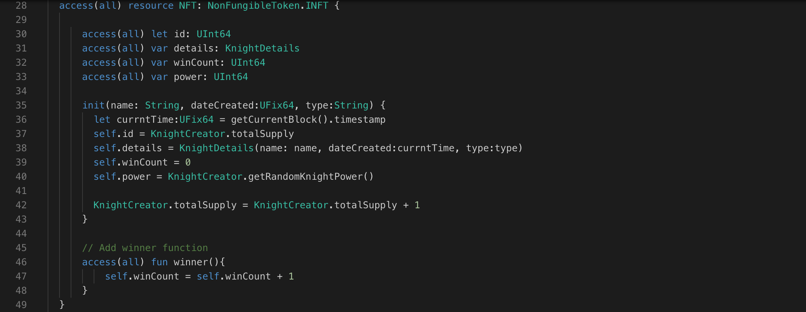
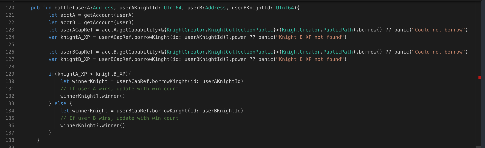

Remember our winCount variable we created lesson 2. We will use that variable in this lesson.
While we create the battle function but still we can't able to track with user knight is winning. Right? so let's we're add a function called `winner` which increments the win count of the Knight NFT. This will help the own to know how many match he had won.

```cadence
access(all) contract HelloWorld{

    access(all) var counter: UInt64

    pub fun winner() {
        self.counter = self.counter + 1
    }

    init(){
        self.counter = 0
    }
}
```

### **Putting it to the Test:**

1. Open Flow [Playground](https://play.flow.com/)
2. Create a function `winner` in NFT resource and increment the winCount variable.

### Solution !!



---


