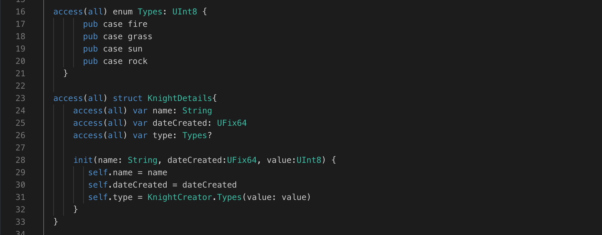
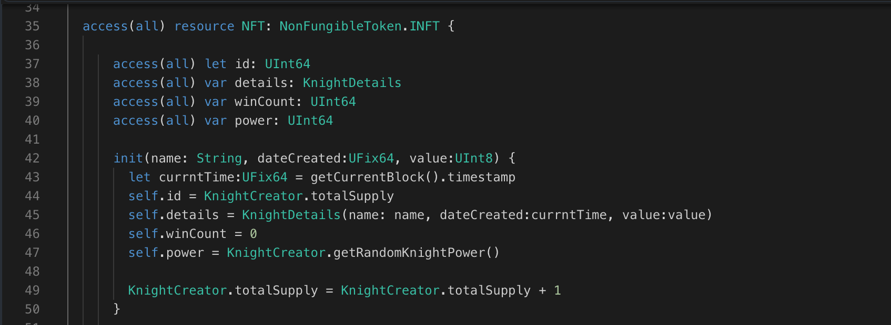
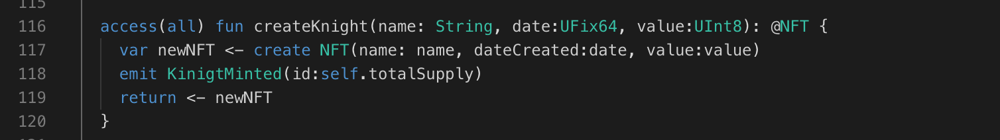

In the previous lessons, we learned about structure for organizing data and enums for restricting variable values. Now, let's see how to combine these to create a super-efficient knight ️⚔️!

Our current Glass struct represents a glass of juice, but what if we want to ensure the size (size variable) can only be "small", "medium", or "large"? We can achieve this by incorporating the CupSize enum we defined within the Cafe contract in Lesson 9:

```jsx
// Define a struct named `Glass` to represent a glass of juice

access(all) struct Glass {

    access(all) let size: CupSize
    access(all) var isFilled: Bool

    init(value: UInt8, isFilled: Bool) {
        self.size = Cafe.CupSize(value: value)
        self.isFilled = isFilled
    }
}

```

### Breaking it Down:

- We update the size variable type in the Glass struct to use the CupSize enum instead of a raw UInt8. This enforces that the size can only be one of the pre-defined options (small, medium, or large).
- The init function is also modified to accept a CupSize value for the size parameter.

### Put it to the Test

1. Open Flow [Playground](https://play.flow.com/)
2. Update the public variable named `env` with newly created `environment` enum
3. Initialize value of `evn`.

### Solution !!



---



---


