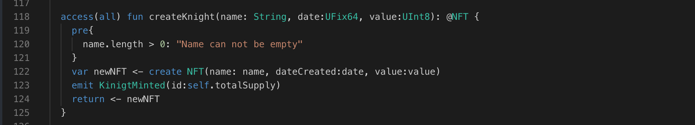

Introducing pre and post condition in contract. If you have some logic which you want to check before going into function the you can add a validation.

Let's take a look how we can do it.

```cadence
pre{
    name.length > 0: "Name can not be empty"
}
```

### Put it to the Test

1. Open Flow [Playground](https://play.flow.com/)
2. Add a pre condition in `createKnight` function, like your name can not by empty

### Solution !!


